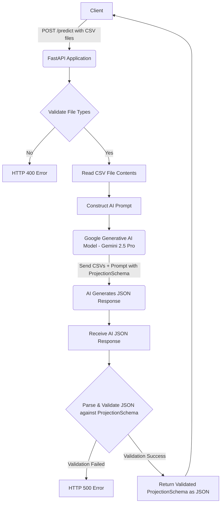

# Financial Projection API

## Overview
The Financial Projection API is an intelligent financial projection engine built with FastAPI, designed to generate comprehensive financial forecasts and insights using Google's Generative AI (Gemini 2.5 Pro with thinking capabilities).

## Architecture and Design

### Application Structure
The `main.py` file contains the core logic with enterprise-grade architecture:

**Key Components:**
* **Comprehensive Pydantic Models**: 11+ detailed data models ensuring type safety and validation
* **AI Integration**: Direct integration with Gemini 2.5 Pro using structured output and thinking configuration
* **Error Handling**: Robust exception handling with detailed logging and HTTP status codes
* **File Validation**: CSV file type validation and content processing
* **Token Usage Tracking**: Monitors AI API consumption for cost optimization

**Pydantic Schema Hierarchy:**
```
ComprehensiveFinancialProjectionResponse
├── ValidationQualityScores (3 instances)
├── ProjectionMethodologyFramework
├── ComprehensiveProjectionsDataset
│   ├── DetailedMonthlyProjection (48 instances)
│   ├── DetailedQuarterlyProjection (20 instances)
│   └── DetailedAnnualProjection (25 instances)
└── ComprehensiveFinancialRatios
```

### Data Flow


## Core Functionality

### Financial Projections Generated
* **1 Year Monthly**: 12 detailed monthly projections starting January next year
* **3 Years Monthly**: 36 monthly projections for medium-term planning
* **5 Years Quarterly**: 20 quarterly projections for strategic planning
* **10 Years Annual**: Long-term strategic projections
* **15 Years Annual**: Extended long-term analysis

### Business Intelligence Features
* **Executive Summary**: Concise key insights and trends
* **Quality Scoring**: Data quality, completion, and projection confidence scores (0.0-1.0)
* **Financial Ratios**: Gross margin, net margin, current ratio, debt-to-equity
* **Risk Analysis**: Identified financial and operational risks
* **Strategic Recommendations**: Actionable insights based on projections
* **Anomaly Detection**: Unusual patterns in historical data

### AI Configuration
* **Model**: Gemini 2.5 Pro with thinking capabilities (32,768 token thinking budget)
* **Temperature**: 0.1 (low randomness for financial accuracy)
* **Response Format**: Structured JSON with strict schema validation
* **Input**: CSV files processed as multipart form data

## API Endpoints

### `GET /`
Health check endpoint returning API status.

### `POST /predict`
**Description**: Main projection endpoint accepting P&L and Balance Sheet CSV files

**Request Format**: `multipart/form-data`
**Required Files**:
* `profit_loss_file`: Profit and Loss CSV file
* `balance_sheet_file`: Balance Sheet CSV file

**Response**: Comprehensive financial projection JSON with 200+ data points

### `GET /health`
System health check with timestamp.

## Testing with Postman

### Prerequisites
1. Install dependencies: `pip install -r requirements.txt`
2. Set up Google GenAI API key in your environment
3. Start server: `python main.py`
4. Verify server is running at `http://localhost:8000`

### Step-by-Step Postman Testing

#### Test 1: Health Check
1. **Method**: `GET`
2. **URL**: `http://localhost:8000/health`
3. **Expected Response**: `{"status": "healthy", "timestamp": "2025-01-XX..."}`

#### Test 2: Root Endpoint
1. **Method**: `GET`
2. **URL**: `http://localhost:8000/`
3. **Expected Response**: `{"message": "Financial Projection API is running"}`

#### Test 3: Financial Projection (Main Endpoint)
1. **Method**: `POST`
2. **URL**: `http://localhost:8000/predict`
3. **Headers**: 
   * Content-Type: `multipart/form-data` (Postman sets automatically)
4. **Body**: 
   * Select `form-data`
   * Add key `profit_loss_file`, type `File`, upload your P&L CSV
   * Add key `balance_sheet_file`, type `File`, upload your Balance Sheet CSV
5. **Expected Response**: JSON with comprehensive financial projections (may take 30-60 seconds)

#### Test 4: Error Handling - Invalid File Type
1. **Method**: `POST`
2. **URL**: `http://localhost:8000/predict`
3. **Body**: Upload non-CSV files (e.g., .txt files)
4. **Expected Response**: `400 Bad Request` with error message

#### Test 5: Error Handling - Missing Files
1. **Method**: `POST`
2. **URL**: `http://localhost:8000/predict`
3. **Body**: Upload only one file or no files
4. **Expected Response**: `422 Unprocessable Entity`

### Sample Response Structure
```json
{
  "executive_summary": "Business shows strong growth potential...",
  "business_name": "MJV Plumbing Services",
  "completion_score": {"score": 0.95, "rationale": "..."},
  "data_quality_score": {"score": 0.87, "rationale": "..."},
  "projection_confidence_score": {"score": 0.89, "rationale": "..."},
  "projections_data": {
    "one_year_monthly": [...], // 12 months
    "three_years_monthly": [...], // 36 months
    "five_years_quarterly": [...], // 20 quarters
    "ten_years_annual": [...], // 10 years
    "fifteen_years_annual": [...] // 15 years
  },
  "key_financial_ratios": {...},
  "risk_factors": [...],
  "recommendations": [...]
}
```

## Performance Considerations
* **Response Time**: 30-60 seconds for complex financial analysis
* **File Size Limit**: Recommended < 10MB per CSV file
* **Token Usage**: Monitored and logged for cost optimization
* **Concurrency**: FastAPI handles multiple requests efficiently

## Production Deployment
* **Server**: Direct Python execution with `python main.py` (uses Uvicorn internally)
* **Configuration**: Host: 0.0.0.0, Port: 8000 (configured in main.py)
* **Environment**: Set `GOOGLE_GENAI_API_KEY` environment variable
* **Monitoring**: Comprehensive logging with timestamp and severity levels
* **Health Check**: `/health` endpoint for load balancer monitoring

## Error Codes
* `400`: Invalid file format or missing required files
* `422`: Request validation failed
* `500`: Internal server error or AI service unavailable